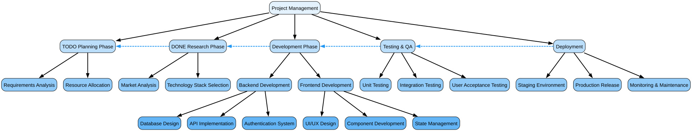

#+TITLE: org-graphviz-mindmap
#+AUTHOR:
#+DATE: 2025

* Overview

Generate clean, hierarchical mind maps from Org mode files using Graphviz.

* Features

- 📊 *Clean Hierarchy*: Top-to-bottom layout with clear parent-child relationships
- 🎨 *Level-based Coloring*: Same-level headings share the same color and height
- 🔗 *Org-ID Links*: Dashed blue arrows show cross-references between nodes
- ✅ *TODO Keywords*: Optionally include TODO/DONE states in node labels
- 📤 *Multiple Formats*: Export to PNG, SVG, or PDF
- ⚡ *Simple & Efficient*: Clean, optimized codebase

* Installation

** Prerequisites

Install Graphviz:

#+begin_src bash
# Ubuntu/Debian
sudo apt-get install graphviz

# macOS
brew install graphviz

# Windows
# Download from https://graphviz.org/download/
#+end_src

** Manual Installation

#+begin_src bash
git clone https://github.com/nowislewis/org-graphviz-mindmap.git
#+end_src

Add to your Emacs config:

#+begin_src elisp
(add-to-list 'load-path "/path/to/org-graphviz-mindmap")
(require 'org-graphviz-mindmap)
#+end_src

* Usage

** Generate Mind Map

Open an Org file and run:

#+begin_example
M-x org-graphviz-mindmap-create
#+end_example

This will:
1. Generate a mind map from your current Org buffer
2. Save the image to =/tmp/= with a timestamp (e.g., =/tmp/my-file-20251121-174143.png=)
3. Save the DOT source to =/tmp/= as well (e.g., =/tmp/my-file-20251121-174143.dot=)
4. *Automatically open the generated image*

No prompts, no file selection - just instant visualization!

** View DOT Source

To see the generated Graphviz DOT code in a buffer:

#+begin_example
M-x org-graphviz-mindmap-show-dot
#+end_example

* Example

Given this Org file:

#+begin_src org
,* Project
:PROPERTIES:
:ID: project-id
:END:

,** TODO Design
,*** Wireframes
,*** Mockups

,** DONE Development
:PROPERTIES:
:ID: dev-id
:END:

,*** Backend
,*** Frontend

,** Testing
See [[id:dev-id][Development]] for context
#+end_src

The mind map will show:

- *Level 1* (Project): Light blue nodes at the top
- *Level 2* (Design, Development, Testing): Medium blue nodes, same height
- *Level 3* (Wireframes, Mockups, Backend, Frontend): Darker blue nodes, same height
- *Solid arrows*: Parent → child relationships
- *Dashed blue arrow*: Testing → Development (org-id link)

* Configuration

** Output Format

#+begin_src elisp
(setq org-graphviz-mindmap-output-format "svg")  ;; "png", "svg", or "pdf"
#+end_src

** Level Colors

Customize colors for each level (same level = same color):

#+begin_src elisp
(setq org-graphviz-mindmap-level-colors
      '("#FFF3E0" "#FFE0B2" "#FFCC80" "#FFB74D" "#FFA726" "#FF9800"))
#+end_src

Default is a blue gradient:
- Level 1: ~#E3F2FD~ (very light blue)
- Level 2: ~#BBDEFB~ (light blue)
- Level 3: ~#90CAF9~ (medium blue)
- Level 4: ~#64B5F6~ (blue)
- Level 5+: ~#42A5F5~ (deeper blue)

** TODO Keywords

Disable TODO keywords in labels:

#+begin_src elisp
(setq org-graphviz-mindmap-include-todo-keywords nil)
#+end_src

* Color Themes

** Warm Orange Theme

#+begin_src elisp
(setq org-graphviz-mindmap-level-colors
      '("#FFF3E0" "#FFE0B2" "#FFCC80" "#FFB74D" "#FFA726" "#FF9800"))
#+end_src

** Green Nature Theme

#+begin_src elisp
(setq org-graphviz-mindmap-level-colors
      '("#F1F8E9" "#DCEDC8" "#C5E1A5" "#AED581" "#9CCC65" "#8BC34A"))
#+end_src

** Purple Gradient

#+begin_src elisp
(setq org-graphviz-mindmap-level-colors
      '("#F3E5F5" "#E1BEE7" "#CE93D8" "#BA68C8" "#AB47BC" "#9C27B0"))
#+end_src

** Monochrome

#+begin_src elisp
(setq org-graphviz-mindmap-level-colors
      '("#FAFAFA" "#F5F5F5" "#EEEEEE" "#E0E0E0" "#BDBDBD" "#9E9E9E"))
#+end_src

* How It Works

1. *Parse*: Uses ~org-element-parse-buffer~ to extract all headings
2. *Group*: Groups headings by level for rank alignment
3. *Generate DOT*: Creates Graphviz DOT code with:
   - ~rank=same~ for same-level nodes (ensures equal height)
   - Level-based colors
   - Hierarchical edges (parent → child)
   - Org-id link edges (dashed, constraint=false)
4. *Render*: Calls ~dot~ to generate the image

* Technical Details

** Layout Strategy

- Uses Graphviz ~rank=same~ to ensure all nodes at the same level appear at the same vertical position
- Top-to-bottom (~rankdir=TB~) for natural reading flow
- Org-id links use ~constraint=false~ so they don't affect layout hierarchy

** Node Styling

- All nodes: ~box~ shape with rounded corners
- Fill color based on heading level
- Consistent sizing across same level

** Edge Types

- *Solid black edges*: Parent-child hierarchy (2px width)
- *Dashed blue edges*: Org-id cross-references (constraint=false)

* Troubleshooting

** "dot: command not found"

Install Graphviz (see [[*Prerequisites][Prerequisites]] above).

** "Not in Org mode"

Ensure your current buffer is an Org file (=.org= extension).

** Large files are slow

For files with 100+ headings, generation may take a few seconds. Consider:
- Using SVG format (smaller file size)
- Breaking into smaller Org files

* API

** Functions

- ~org-graphviz-mindmap-create~: Main command - generates mind map, saves to =/tmp/=, and opens it automatically
- ~org-graphviz-mindmap-show-dot~: Display generated DOT source code in a buffer

** Customization Variables

- ~org-graphviz-mindmap-output-format~: Output format (default: "png")
- ~org-graphviz-mindmap-include-todo-keywords~: Include TODO states (default: t)
- ~org-graphviz-mindmap-level-colors~: Color list for levels (default: blue gradient)

** File Locations

Generated files are saved to the system temporary directory:
- Linux/macOS: =/tmp/=
- Windows: =%TEMP%=

File naming pattern: ~<org-file-name>-<timestamp>.<format>~

Example: If you run ~org-graphviz-mindmap-create~ on ~project.org~ at 2:41 PM:
- Image: =/tmp/project-20251121-144143.png=
- DOT source: =/tmp/project-20251121-144143.dot=

* Contributing

Contributions welcome! Please open an issue or pull request.

* License

GNU General Public License v3.0 or later.

* Credits

Built with:
- Emacs Org mode
- Graphviz DOT language
